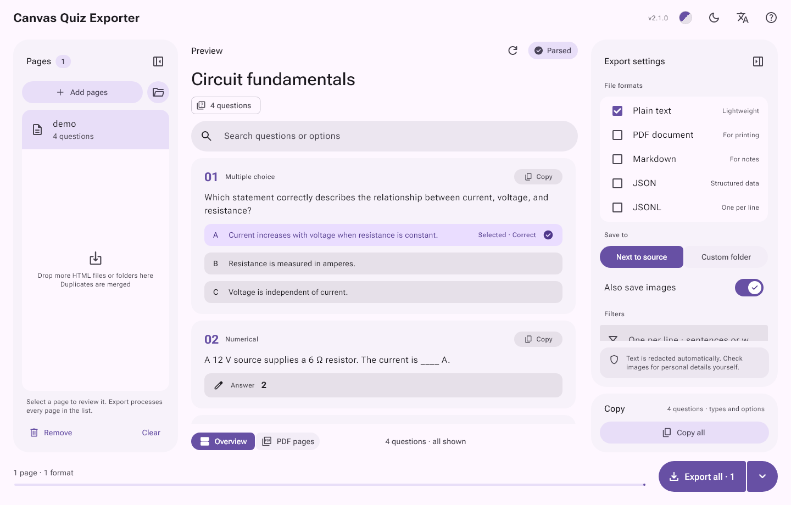
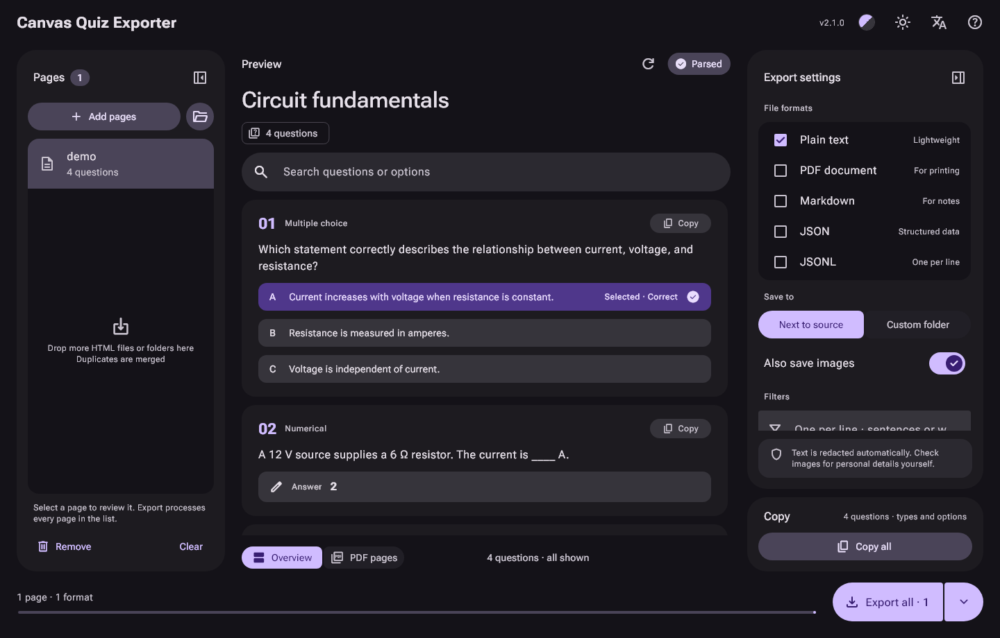

# Canvas Quiz Exporter

Turn saved Canvas quiz pages into readable, searchable files. A Windows desktop app that works fully offline.

[中文](README.md)



<details><summary>Dark theme</summary>



</details>

## Download

1. Download the zip from [Releases](https://github.com/kiliasu/CanvasQuizExporter/releases), extract it and run `CanvasQuizExporter.exe`. Keep the folder intact: the program needs the DLLs and `data/` beside it.
2. In your browser, open a Canvas quiz page with its questions visible and save it as "Webpage, Complete", keeping the HTML and its `_files` folder.
3. Drop the HTML or a folder into the app, check the preview, pick formats and export. TXT is the default, saved next to the HTML.

The app is not code-signed, so Windows may say "Windows protected your PC" on first run; choose "More info → Run anyway".

## Features

| Format | Use | Images |
| --- | --- | --- |
| TXT | Reading and full-text search | Resource index |
| PDF | Printing and archiving | Embedded |
| Markdown | Notes and knowledge bases | Relative links |
| JSON | Structured processing | Relative paths and status |
| JSONL | One question per line | Metadata on every line |

The JSON and JSONL fields are described in [docs/FORMAT.md](docs/FORMAT.md).

- Add pages or folders in bulk; parsing and export run in the background, and cancelling stops after the current file.
- Preview and search questions, with selected and correct answers marked separately; copy one question or all of them.
- Line filters for repeated instructions or sensitive words apply to the preview, the clipboard and every export.
- Real PDF page preview, Letter or A4, and custom TrueType fonts.
- Six color schemes, light and dark themes, and collapsible side panels.
- English and Chinese interface that follows the system language, with a switch at the top of the window.

Classic Canvas question types are supported, including multiple choice, true/false, multiple answers, numerical, fill-in-the-blank, essay and matching. New Quizzes, third-party LTI tools and login-only pages may not work. Correct answers that a page does not show are never guessed.

## Privacy

The app only reads local files. It never logs in to Canvas, runs page scripts, downloads remote images or sends telemetry. Recognizable emails and identity fields are removed, and you can add your own filters. Images are not redacted, so check exports before sharing them. Settings stay on your computer in `%APPDATA%\CanvasQuizExporter\`.

## Build from source

Requires Windows, Flutter 3.47.5 and Visual Studio 2022 with "Desktop development with C++".

```powershell
./tool/prepare_windows.ps1
flutter run -d windows --no-pub
```

`./tool/build_windows.ps1` runs every check and builds the release into `build/windows/x64/runner/Release/`. If PowerShell refuses to run scripts, use `powershell -ExecutionPolicy Bypass -File .\tool\prepare_windows.ps1`, which applies to that run only. `assets/demo.html` is a synthetic quiz to try the app with. See [Contributing](docs/CONTRIBUTING.md) for more.

## License

Application code: [MIT](LICENSE). Third-party components: [THIRD_PARTY_NOTICES.md](THIRD_PARTY_NOTICES.md). Not affiliated with Instructure or Canvas.
