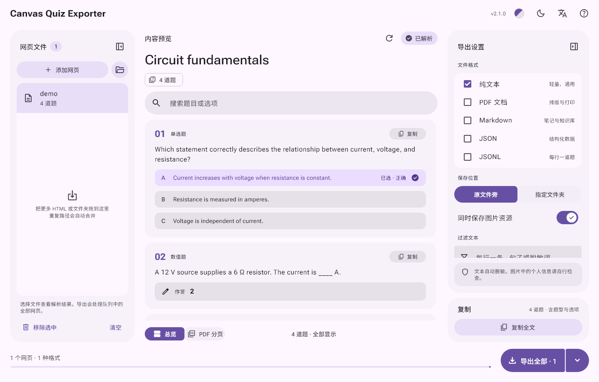
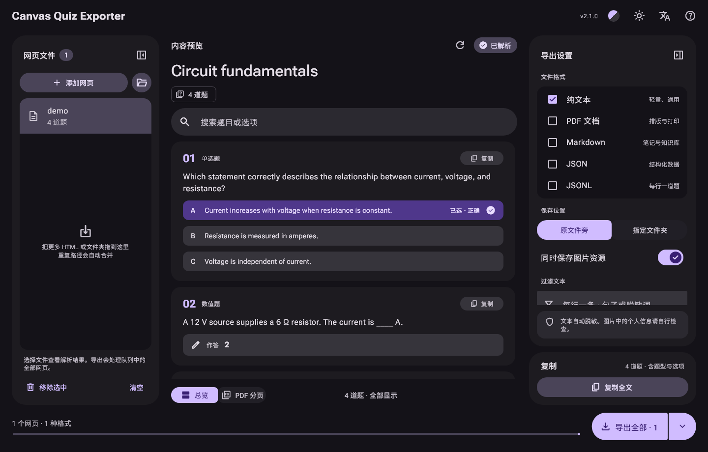

# Canvas Quiz Exporter

把浏览器保存的 Canvas 测验网页整理成可阅读、可检索的文件。Windows 桌面应用，完全离线。

[English](README.en.md)



<details><summary>深色主题</summary>



</details>

## 下载使用

1. 从 [Releases](https://github.com/kiliasu/CanvasQuizExporter/releases) 下载 zip，解压后运行 `CanvasQuizExporter.exe`。请保持文件夹完整，程序依赖同目录下的 DLL 和 `data/`。
2. 在浏览器中打开已显示题目的 Canvas 测验页面，保存为「网页，全部」，保留 HTML 和同名的 `_files` 文件夹。
3. 把 HTML 或整个文件夹拖进应用，确认预览，选择格式后导出。默认导出 TXT，保存在原 HTML 旁边。

程序没有代码签名，首次运行时 Windows 可能提示"已保护你的电脑"，点"更多信息 → 仍要运行"即可。

## 功能

| 格式 | 用途 | 图片 |
| --- | --- | --- |
| TXT | 阅读和全文检索 | 配套资源索引 |
| PDF | 打印、归档 | 嵌入本地图片 |
| Markdown | 笔记和知识库 | 相对路径引用 |
| JSON | 结构化处理 | 相对路径与状态 |
| JSONL | 逐题处理 | 每行一道题及元信息 |

JSON / JSONL 的字段说明见 [docs/FORMAT.md](docs/FORMAT.md)。

- 批量添加网页或文件夹，后台解析和导出；取消时会完成当前文件再停止。
- 预览和搜索题目，区分已选答案与正确答案，单题或全文复制。
- 按行过滤重复说明或敏感词，预览、复制和导出的结果一致。
- 真实的 PDF 分页预览，支持 Letter / A4 和自定义 TTF 字体。
- 六种配色、深浅主题，侧栏可以折叠。
- 中英文界面：默认跟随系统语言，也可以在窗口顶部切换。

支持 Classic Canvas 的选择、判断、多选、数值、填空、简答和配对等题型。New Quizzes、第三方 LTI 和只有登录页的 HTML 不保证兼容。程序不会猜测页面没有公开的正确答案。

## 隐私

只读取本地文件：不登录 Canvas，不执行网页脚本，不下载远程图片，没有遥测。能识别的邮箱和身份信息会被移除，也可以自行添加过滤词。图片内容不做处理，分享导出结果前请自行检查。设置只保存在本机的 `%APPDATA%\CanvasQuizExporter\` 中。

## 从源码构建

需要 Windows、Flutter 3.47.5 和 Visual Studio 2022 的「使用 C++ 的桌面开发」。

```powershell
./tool/prepare_windows.ps1
flutter run -d windows --no-pub
```

`./tool/build_windows.ps1` 会运行全部检查并生成发布版本，结果在 `build/windows/x64/runner/Release/`。如果 PowerShell 禁止运行脚本，可改用 `powershell -ExecutionPolicy Bypass -File .\tool\prepare_windows.ps1`，只对这一次运行生效。`assets/demo.html` 是可以用来试用的合成示例。更多说明见[开发说明](docs/CONTRIBUTING.md)。

## 许可证

应用代码采用 [MIT](LICENSE) 许可证，第三方组件见 [THIRD_PARTY_NOTICES.md](THIRD_PARTY_NOTICES.md)。本项目与 Instructure / Canvas 无隶属关系。
